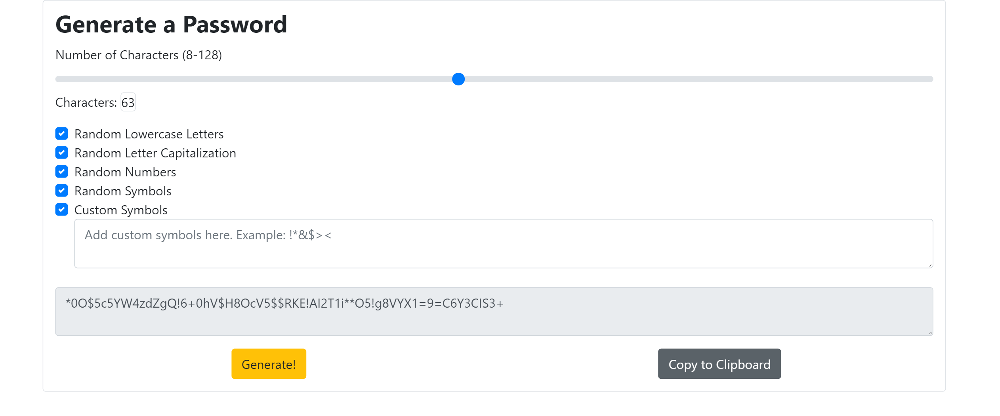

# Secure_Password_Generator

## WHO MADE THIS?

I did, with a little help from the internet. Thanks, internet.

## WHAT IS THIS?

This is a random password generator. It was made using HTML and JavaScript and was stylized using Bootstrap. This generator will make a password between 8 - 128 characters and will generate the password with any combination of upper and lower case letters, numbers and symbols. It also allows the user to copy the generated password straight to their clipboard and paste it immediately.

## WHY DID I MAKE THIS?

This was a homework assignment for a full-stack web developement boot camp. It was created to show understanding of basic JavaScript using loops, conditionals, functions and managing and creating arrays and objects, while also interacting with the DOM for user input.

## FUTURE DEVELOPMENT

I will add radio buttons to replace the checkboxes for easier understanding of the custom characters checkbox. I would also like to add a store to allow users to save passwords locally on their browser and associate a URL and username with them. This would be more secure than keeping passwords on a server that is vulnerable to cyber attacks.
